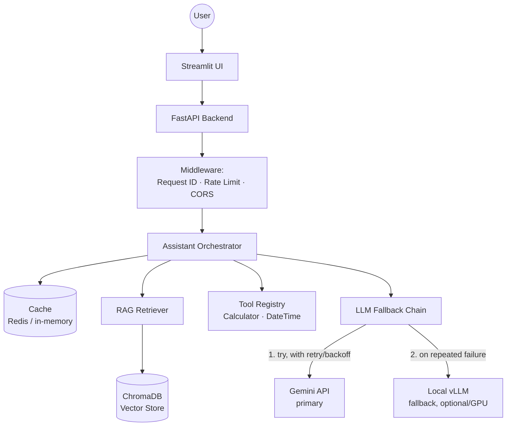
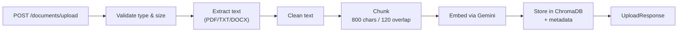
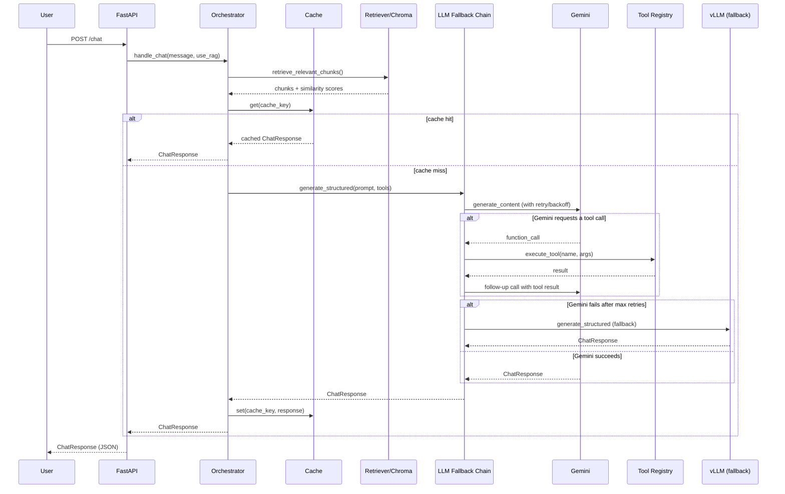

# Architecture

## High-level system diagram

```mermaid
flowchart TB
    User((User))
    UI[Streamlit UI]
    API[FastAPI Backend]
    MW["Middleware:<br/>Request ID · Rate Limit · CORS"]
    ORCH[Assistant Orchestrator]
    CACHE[(Cache<br/>Redis / in-memory)]
    RAG[RAG Retriever]
    CHROMA[(ChromaDB<br/>Vector Store)]
    TOOLS[Tool Registry<br/>Calculator · DateTime]
    CHAIN[LLM Fallback Chain]
    GEMINI[Gemini API<br/>primary]
    VLLM[Local vLLM<br/>fallback, optional/GPU]

    User --> UI --> API --> MW --> ORCH
    ORCH --> CACHE
    ORCH --> RAG --> CHROMA
    ORCH --> TOOLS
    ORCH --> CHAIN
    CHAIN -->|1. try, with retry/backoff| GEMINI
    CHAIN -->|2. on repeated failure| VLLM
```

## Document ingestion flow

```mermaid
flowchart LR
    Upload[POST /documents/upload] --> Validate[Validate type & size]
    Validate --> Extract["Extract text<br/>(PDF/TXT/DOCX)"]
    Extract --> Clean[Clean text]
    Clean --> Chunk["Chunk<br/>800 chars / 120 overlap"]
    Chunk --> Embed[Embed via Gemini]
    Embed --> Store["Store in ChromaDB<br/>+ metadata"]
    Store --> Done[UploadResponse]
```

## Chat / RAG / tool-calling flow

```mermaid
sequenceDiagram
    participant U as User
    participant API as FastAPI
    participant O as Orchestrator
    participant C as Cache
    participant R as Retriever/Chroma
    participant L as LLM Fallback Chain
    participant G as Gemini
    participant T as Tool Registry
    participant V as vLLM (fallback)

    U->>API: POST /chat
    API->>O: handle_chat(message, use_rag)
    O->>R: retrieve_relevant_chunks()
    R-->>O: chunks + similarity scores
    O->>C: get(cache_key)
    alt cache hit
        C-->>O: cached ChatResponse
        O-->>API: ChatResponse
    else cache miss
        O->>L: generate_structured(prompt, tools)
        L->>G: generate_content (with retry/backoff)
        alt Gemini requests a tool call
            G-->>L: function_call
            L->>T: execute_tool(name, args)
            T-->>L: result
            L->>G: follow-up call with tool result
        end
        alt Gemini fails after max retries
            L->>V: generate_structured (fallback)
            V-->>L: ChatResponse
        else Gemini succeeds
            G-->>L: ChatResponse
        end
        L-->>O: ChatResponse
        O->>C: set(cache_key, response)
        O-->>API: ChatResponse
    end
    API-->>U: ChatResponse (JSON)
```
